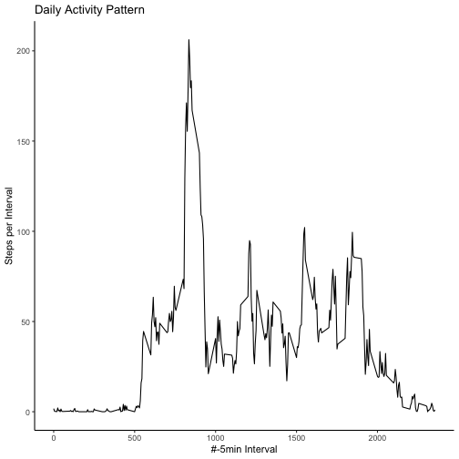

Reproducible Research Project 1
===============================
---
title: "PA1_template.Rmd"
author: "Me!"
date: "10 November 2020"
output: html_document
---


```r
knitr::opts_chunk$set(echo = TRUE)
library(tidyverse)
library(chron)
```

## Loading data

```r
unzip("activity.zip")
activity<-read.csv("activity.csv")
```


##Question 1: What is mean total number of steps taken per day?
Data will be processed using commands from dplyr package:
-data will be grouped by dates with the group_by command 
-steps per day will be summarized using the summarize command 
Afterwards a histogram will be plottted using the base plotting system

```r
activity_grouped_bydate<-group_by(activity,date)
activity_sum_bydate<-summarize(activity_grouped_bydate,steps_by_day=sum(steps,na.rm=TRUE))
hist(activity_sum_bydate$steps_by_day, breaks=10,xlab="Steps",main="Steps by day")
```


###Mean of total steps per day:

```r
mean(activity_sum_bydate$steps_by_day,na.rm=TRUE)
```

```
## [1] 9354.23
```

###Median of total steps per day:

```r
median(activity_sum_bydate$steps_by_day,na.rm=TRUE)
```

```
## [1] 10395
```


## Question 2: What is the average daily activity pattern?
As before data will be transformed using commands group_by and summarize from the dplyr package. The results are depicted in a line diagram generated with the ggplot2 package

```r
#Data transformation
activity_groupedby_interval<-group_by(activity,interval)
activity_meanof_interval<-summarize(activity_groupedby_interval,steps_per_interval=mean(steps,na.rm=TRUE))
#Plot
ggplot(data=activity_meanof_interval)+geom_line(aes(x=interval,y=steps_per_interval))+theme_classic()+labs(title="Daily Activity Pattern",y="Steps per Interval",x="#-5min Interval")
```



###Which 5 minute interval with maximum average number of steps?

```r
max_activity_per_interval<-filter(activity_meanof_interval,steps_per_interval==max(activity_meanof_interval$steps_per_interval))
max_activity_per_interval[1] # 5 minute interval with maximum average number of steps
```

```
## # A tibble: 1 x 1
##   interval
##      <int>
## 1      835
```


##Question 3: Imputing missing values
###Total number of missing values

```r
sum(is.na(activity$steps))
```

```
## [1] 2304
```

###Data Imputation 
Empty fields for steps will be imputed with mean of step count of all days contained in dataset. Results will be represented as a histogram. In comparison to the histogramm before imputation the center of mass of the histogram shits towards higher values since NA values have been replaced by postive values

```r
imputed<-activity
for(i in 1:dim(imputed)[1])
{
        if (is.na(imputed$steps[i])==TRUE)
        {
        imputed[i,1]<-as.numeric(activity_meanof_interval[activity_meanof_interval$interval==imputed$interval[i],2])
        }        
}
imputed_grouped_bydate<-group_by(imputed,date)
imputed_sum_bydate<-summarize(imputed_grouped_bydate,steps_by_day=sum(steps,na.rm=TRUE))
hist(imputed_sum_bydate$steps_by_day, breaks=10,xlab="Steps",main="Steps by day after imputation")
```


###Mean steps per day after imputation
The mean has increased since NA has been replaced by positive value

```r
mean(imputed_sum_bydate$steps_by_day,na.rm=TRUE)
```

```
## [1] 10766.19
```

###Median steps per day after imputation
The median has increased since NA has been replaced by positive value

```r
median(imputed_sum_bydate$steps_by_day,na.rm=TRUE)
```

```
## [1] 10766.19
```


## Question 4: Are there differences in activity patterns between weekdays and weekends?
Distinction between weekends and weekdays was achieved with is.weekend command from the Chron package. Therefore activity during weekdays is represented in the facet "FALSE" and weekend in the facet "TRUE" in the plot 

```r
imputed_wkend<-mutate(imputed,Weekend=is.weekend(as.Date(imputed$date)))
# Grouping and summary per Weekday/Weekend
group_weekend<-group_by(imputed_wkend,Weekend,interval)
activity_sum_wkend<-summarize(group_weekend,steps_wkdays=sum(steps,na.rm=TRUE))
#Plot
ggplot(data=activity_sum_wkend)+geom_line(aes(x=interval,y=steps_wkdays))+theme_classic()+labs(title="Daily Activity Weekday (False) vs. Weekend (True)",y="Steps per Interval",x="#-5min Interval")+facet_wrap(~ Weekend)
```


